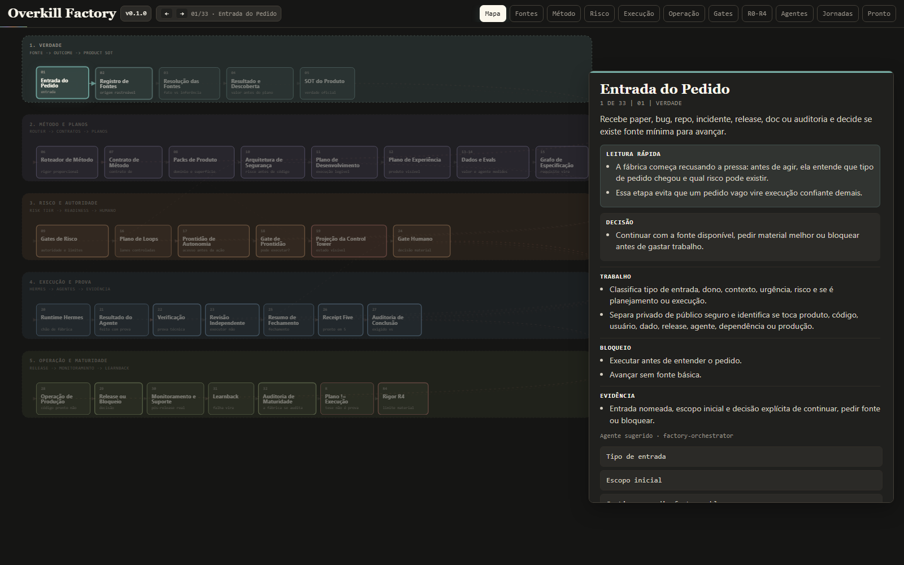

# Overkill Factory

Idioma: [English](README.md) | **Português**

Overkill Factory é uma linha de produção open source para trabalho de produto
com agentes. Ela ajuda um operador Hermes a transformar um paper de produto ou
projeto cru em uma sequência controlada de resolução de fontes, planejamento,
arquitetura, trabalho especialista, evidência, revisão, gates e receipts.

O projeto não é um prompt de chat. Ele é um conjunto de contratos públicos,
perfis de workers, hooks de adapter, exemplos e scripts de validação que tornam
o trabalho de agentes inspecionável antes que ele possa avançar.

## O Que É

Overkill Factory dá ao Hermes um método de produção de produto:

```text
paper ou brief de projeto
-> resolução de fontes
-> Product SOT
-> arquitetura e roteamento de risco
-> cards Hermes para workers
-> execução especialista
-> evidência e Receipt Five
-> revisão independente e gates humanos
-> prontidão de release
```

O repositório contém o método público, schemas de cards e receipts, registro de
workers, bindings de perfis Hermes, scripts de adapter, testes e um pequeno
exemplo executável.

## Mapa Da Fábrica

[](https://storage.googleapis.com/overkill-factory-public-assets-20apy/overkill-factory-map-v0.1.0.html)

O mapa visual mostra o caminho da fábrica desde source intake até Product SOT,
gates de risco, execução no Hermes, Receipt Five, revisão, release e learnback.
Ele é material de onboarding, não evidência de runtime nem autoridade de fonte.
Use os contratos executáveis, schemas, testes, hooks de adapter e estado Hermes
para provar trabalho real.

Abra a versão interativa hospedada:
https://storage.googleapis.com/overkill-factory-public-assets-20apy/overkill-factory-map-v0.1.0.html

A cópia versionada vive em
`docs/visuals/overkill-factory-map-v0.1.0.html`.

## Para Quem É

Use quando você já opera, ou quer operar, trabalho de produto com Hermes e
precisa de:

- gates repetíveis em vez de handoffs informais de agentes;
- papéis explícitos de workers para planejamento, build, segurança, prova e
  release;
- receipts que tornam conclusão inspecionável para além de uma conversa;
- uma forma de deixar agentes trabalharem sem remover autoridade humana em
  decisões de alto risco.

É especialmente útil para times de produto, builders solo e operadores de
agentes que querem ajuda autônoma sem fingir que autonomia remove gates,
controle de acesso, revisão ou responsabilidade de release.

## O Que Faz

Overkill Factory fornece:

- um contrato de card para descrever fase, risco, escopo, runtime, segurança e
  evidência de pronto;
- um registro de workers e bindings de perfis Hermes para rotear trabalho ao
  papel certo;
- um registro de capability packs para checar se o tipo de produto tem cobertura
  especialista pronta antes da execução;
- uma CLI `factoryctl` para saúde de instalação, inicialização de projeto, smoke
  local, validação de cards, gate reports e worker packets;
- um adapter Hermes e transition hook que podem bloquear transições fracas para
  `ready` e `done`;
- exemplos públicos seguros e contratos de receipt;
- scans de segurança para segredos e erros de fronteira público/privado.

## Limites De Operação

Overkill Factory foi desenhada para manter decisões materiais explícitas:

- material de fonte é obrigatório antes de uma afirmação de produto virar
  escopo;
- arquitetura, segurança, release e gates humanos precisam de aprovação
  registrada ou bloqueio registrado;
- deploys de produção, fundos, signing e chaves reais ficam sob runtime,
  credenciais e autoridade do operador;
- Codex Security, Auditor, Product Face proof, QA e revisão humana continuam
  sendo caminhos de evidência especialista, não resumos em prosa;
- Discord ou outra Control Tower pode ser cockpit do operador, enquanto Hermes,
  referências de evidência e Receipt Five continuam sendo o estado durável;
- cada card roda apenas os workers exigidos por fase, superfícies, risco e
  definição de pronto;
- capability packs definem quais superfícies de produto são executáveis hoje.
  Se um tipo de produto ainda não tem cobertura, a fábrica registra a lacuna em
  vez de fingir que o caminho especialista existe.

Esse limite é intencional: a fábrica ajuda agentes a avançarem mais rápido sem
esconder lacunas de fonte, autoridade ausente ou afirmações de release sem
prova.

## Como O Hermes Entra

Hermes é o primeiro runtime suportado. Overkill Factory fornece o método e os
contratos da fábrica; Hermes fornece o chão Kanban onde cards, workers e
transições de estado vivem.

Os arquivos de adapter ficam em `adapters/hermes/`:

- `adapters/hermes/README.md` explica o patch e o modelo de transição.
- `adapters/hermes/transition_hook.py` prepara roteamento de workers e
  reconciliação de evidência na hora do done.
- `agents/hermes-profile-bindings.public.json` mapeia workers públicos para
  nomes de perfis Hermes, filas, skills e campos de receipt.

Você pode rodar validação local sem Discord. Configure uma Control Tower só
depois que o caminho local de card, worker packet e receipt estiver claro.

## Caminho Do Operador

Para uma pessoa ou IA instalando a fábrica no próprio Hermes, use primeiro o
caminho da CLI e abra contratos densos só quando necessário:

```bash
python -m pip install -e .
factoryctl doctor
factoryctl run minimal
factoryctl init --out ../my-product-factory --project-name my-product
```

Depois leia `docs/getting-started/install-in-hermes.md` e conecte os worker
packets gerados ao seu runtime Hermes de teste. A fábrica fica fácil de manter
quando fluxos comuns passam por `factoryctl` e detalhes de manutenção ficam
atrás de docs, schemas e testes.

## Quickstart

Smoke local de três comandos a partir de um checkout limpo:

```bash
git clone https://github.com/<owner>/overkill-factory.git
cd overkill-factory
python -m pip install -e .
factoryctl doctor
factoryctl run minimal
```

O smoke escreve `.tmp/quickstart-result.json` e os worker packets necessários em
`.tmp/minimal-worker-packets/`. Leia
`docs/getting-started/quickstart-hermes.md` para o mesmo caminho com notas de
configuração do Hermes.

`python scripts/quickstart_smoke.py` e `overkill-quickstart` continuam como
entrypoints de compatibilidade, mas `factoryctl run minimal` é o caminho público
do operador.

## Primeiro Valor Em 10 Minutos

O primeiro valor é binário: o quickstart imprime `PASS`, escreve
`.tmp/quickstart-result.json` e gera worker packets em
`.tmp/minimal-worker-packets/`.

Depois dessa execução, você deve saber:

- se o contrato mínimo de card é válido;
- quais workers são obrigatórios antes da execução;
- se o gate está pronto para execução por workers;
- quais arquivos de packet o Hermes receberia em seguida.

Worker packets e gate reports gerados pertencem a `.tmp/`, não ao repositório
público. Commite exemplos de fonte, schemas, scripts e testes; regenere outputs
de execução localmente.

## Formato Do Repositório

Todo diretório público abaixo tem um README local com propósito, fronteira,
fonte da verdade e caminho de validação. Abra esse README antes de tratar uma
pasta como lugar para adicionar arquivos.

| Caminho | Propósito Público |
| --- | --- |
| `.github/` | CI, templates de issue e higiene de pull request. |
| `adapters/` | Integrações de runtime, atualmente hooks e patches de transição Hermes. Veja `adapters/README.md`. |
| `agents/` | Registro público de workers, perfis, permissões e bindings Hermes. Veja `agents/README.md`. |
| `docs/` | Guias humanos, visuais, conceitos, operações, agentes e integrações. Veja `docs/README.md`. |
| `examples/` | Pequenos exemplos de fonte e fixtures que ensinam ou testam o caminho da fábrica. Veja `examples/README.md`. |
| `products/` | Produtos públicos de validação usados por checks product-like e production-lane. Veja `products/README.md`. |
| `schemas/` | Contratos de máquina para cards, receipts, outputs de workers e gates. Veja `schemas/README.md`. |
| `scripts/` | Entrypoints de CLI, validadores, helpers de prova e checks de manutenção. Veja `scripts/README.md`. |
| `skills/` | Material instalável de skill Codex para operar a fábrica. Veja `skills/README.md`. |
| `templates/` | Templates de contrato pareados com schemas e testes. Veja `templates/README.md`. |
| `tests/` | Cobertura de regressão para contratos públicos e quickstart. Veja `tests/README.md`. |

## Status Atual

O repositório público tem schemas validados, perfis de workers, bindings de
perfis Hermes, hooks de adapter, safety scans, CLI empacotada e um exemplo
público executável. O patch de adapter e o transition hook são públicos, e a
suíte de validação local é o primeiro check obrigatório antes de publicação ou
trabalho de release.

O projeto ainda não é um serviço hospedado e não é um lançamento de produção. O
usuário precisa conectá-lo ao próprio runtime Hermes, configurar ferramentas
reais que workers devem usar e fornecer registros reais de aprovação para
trabalho de alto risco.

## Autoridade Da Documentação

O caminho atual para usuário externo é este README, o quickstart, o flow
conceitual, o checklist de operações e os gates executáveis. Histórico narrativo
de validação, roadmaps antigos, relatos de piloto e notas de pesquisa não
pertencem ao onboarding público.

Quando documentos discordarem, use esta ordem:

1. `scripts/factoryctl.py`, schemas, hooks de adapter e testes.
2. `README.md`, `README.pt-BR.md`, `docs/getting-started/quickstart-hermes.md`,
   `docs/concepts/factory-flow.md`,
   `docs/concepts/overkill-factory-method.md`,
   `docs/concepts/operator-journey.md` e
   `docs/operations/validation-and-release.md`.
3. Docs de suporte de agentes, workers, capabilities, segurança e Product Face.
4. Outputs locais gerados em `.tmp/factory-runs/` apenas para a execução que os
   produziu. Eles não são autoridade de fonte e não devem ser commitados.
   Worker packets e gate reports gerados pertencem a `.tmp/`.

Veja `docs/governance/document-governance.md` para as regras de status
documental. Uma ideia de tarefa não vira gate de runtime até ter schema, script,
teste, worker, regra de adapter ou contrato de receipt.

## Mapa Da Documentação

- `docs/governance/document-governance.md`: o que pertence a docs públicas
  versus evidência local/privada.
- `docs/index.md`: home e navegação da documentação.
- `docs/getting-started/quickstart-hermes.md`: primeira execução com seu próprio
  Hermes.
- `docs/getting-started/install-in-hermes.md`: instalar e conectar a fábrica a
  um runtime Hermes do operador.
- `docs/reference/cli.md`: comandos suportados de `factoryctl`.
- `docs/concepts/factory-flow.md`: conceitos centrais e fluxo de fases.
- `docs/concepts/overkill-factory-method.md`: guia humano do método.
- `docs/concepts/operator-journey.md`: jornada passo a passo do operador.
- `docs/visuals/README.md`: fronteiras e regras de validação dos visuais.
- `docs/visuals/overkill-factory-map-v0.1.0.png`: screenshot real de preview do
  mapa interativo hospedado.
- `docs/visuals/overkill-factory-map-v0.1.0.html`: mapa interativo da linha da
  fábrica, tiers de risco e catálogo público de agentes.
- `docs/visuals/overkill-factory-map-v0.1.0.svg`: diagrama estático legado
  mantido como asset secundário.
- `docs/agents/worker-profiles.md`: papéis de workers, inputs, outputs, limites
  e evidência.
- `agents/README.md`: entrada humana para o diretório de contratos de agentes.
- `docs/agents/factory-stage-agent-map.md`: qual worker possui cada etapa
  canônica e que prova bloqueia o próximo passo.
- `docs/agents/capability-packs.md`: cobertura pronta de produto e regras de
  ativação de packs.
- `docs/control-tower/open-source-setup.md`: setup opcional de Discord/Control
  Tower.
- `docs/operations/validation-and-release.md`: checklist de validação e release.
- `docs/operations/release-policy.md`: versionamento semântico, checks de
  release e fronteira do point 5.
- `docs/operations/troubleshooting.md`: falhas comuns e como continuar.
- `docs/architecture/hermes-integration.md`: integração de adapter e runtime.
- `docs/examples/gallery.md`: que exemplo usar para caminhos mínimo,
  Product Face, segurança e onchain.
- `docs/security/oss-security.md`: controles de segurança do repositório.
- `docs/maintenance/repo-surface.md`: superfície do operador versus internals de
  manutenção e output gerado.
- `examples/minimal-hermes-project/README.md`: pequeno exemplo public-safe.
- `.env.example`: template seguro de variáveis de ambiente.
- `CHANGELOG.md`: histórico público de releases.
- `CONTRIBUTING.md`: regras de contribuição e checks obrigatórios.
- `SECURITY.md`: reporte de segurança e política de fronteira pública.

## Segurança Pública

Artefatos públicos não devem conter segredos, dumps de fonte privada, caminhos
locais absolutos, links privados de board, logs brutos ou histórico operacional
privado.

Rode estes comandos antes de publicar:

```bash
python scripts/validate_document_governance.py
python scripts/secret_safety_scan.py
python scripts/public_safety_scan.py
python scripts/validate_public_json_artifacts.py
```

## Licença

MIT.
